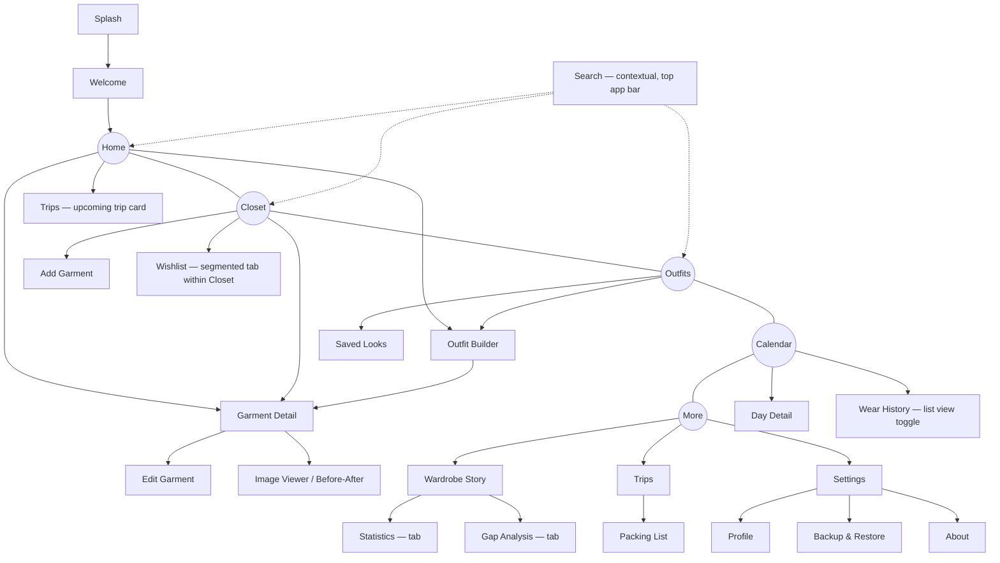

# Navigation Flow

## Information architecture

Five top-level destinations — deliberately not more. A sixth icon in the dock would
start to feel like a control panel, not a console; several of the 22 required screens
are reached as sub-screens of these five rather than each getting an equal-weight
slot, which is itself a design decision (see below), not an omission.

**IA decisions worth stating explicitly**:

- **Wishlist lives inside Closet** (a segmented "My Closet / Wishlist" control at the
  top of the screen), not as its own nav destination or buried in More — it's
  conceptually "things not yet in my closet," adjacent enough to browsing that it
  belongs in the same place, and doesn't earn a 6th dock slot.
- **Statistics and Gap Analysis are tabs inside Wardrobe Story**, not three separate
  destinations. "My Wardrobe Story" is the warm, personal umbrella name (matching the
  personalization brief); Statistics is its data view, Gap Analysis its "what's
  missing" view. Three peers in a menu would read as a dashboard; two tabs inside one
  story read as one coherent feature.
- **Packing List is reached through a specific Trip**, not the top level — it has no
  meaning without a trip already selected.
- **Profile, Backup & Restore, and About are sub-screens of Settings**, not top-level.
  None of them is something the one user of this app opens more than rarely.
- **Search has no dedicated screen of its own in the dock** — it's a contextual
  action (an icon that expands in place, see `motion-guide.md`) available from Home,
  Closet, and Outfits, scoped to whichever section it was opened from. A global
  search that searches everything at once was considered and rejected: this app's
  content types (garments, outfits, trips) are different enough that "search
  everything" mixed results would be less useful than "search this section," and a
  single-user wardrobe app never has so much content that scoped search feels
  limiting.

## Navigation shell per form factor

| Form factor | Shell |
|---|---|
| **Tablet portrait (primary)** | Floating glass dock, bottom-anchored, 5 icons+labels — reachable at arm's height while standing at the wardrobe (Section 0, design system doc) |
| Tablet landscape | The dock rotates to a slim glass rail on the left edge, icons only (labels appear on long-press/focus) — same 5 destinations, same glass treatment |
| Phone (compact) | A standard bottom tab bar — visually related to the tablet dock (same icon set, same active-state treatment) but not floating/glass, since a phone is held in the hand and a floating dock reads as an odd affectation at that size |

## Back-stack behavior

Each of the 5 top-level destinations keeps its own back stack (standard
Navigation-Compose per-destination graphs, `phase-1-architecture.md`/ADR-010) — moving
from Closet → Garment Detail → Edit Garment and then tapping "Outfits" in the dock
does not lose that stack; returning to "Closet" later resumes exactly where it was
left. This matters more than usual here because the app is meant to be picked up and
put down constantly throughout the morning routine, not used in one continuous
session.
