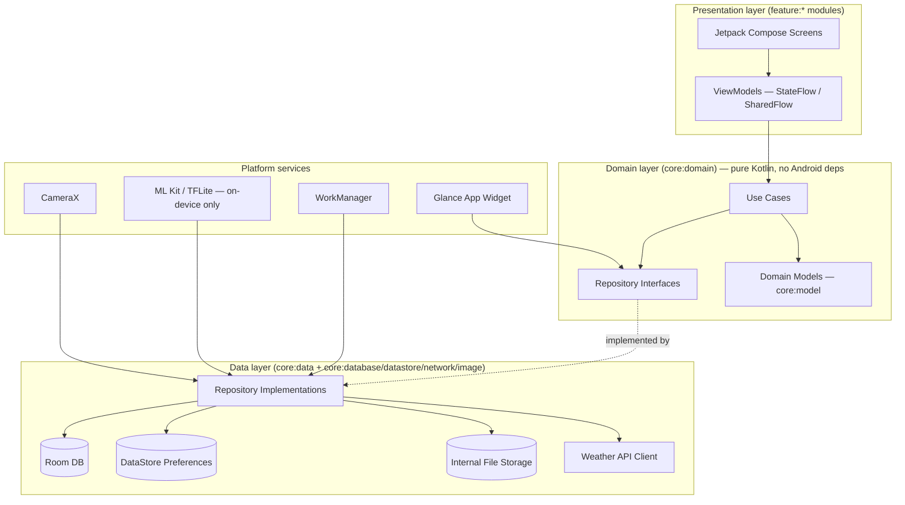
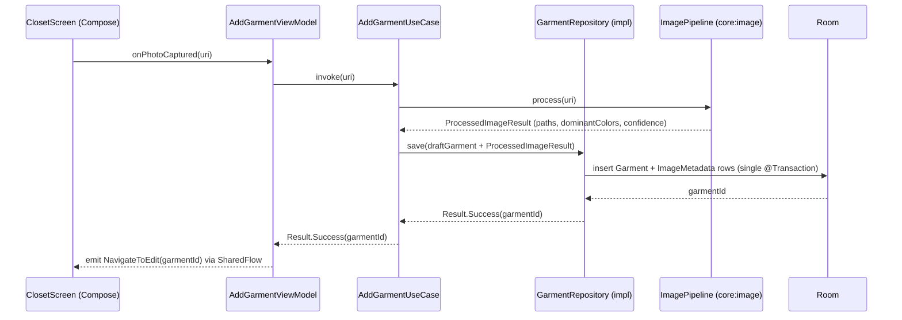
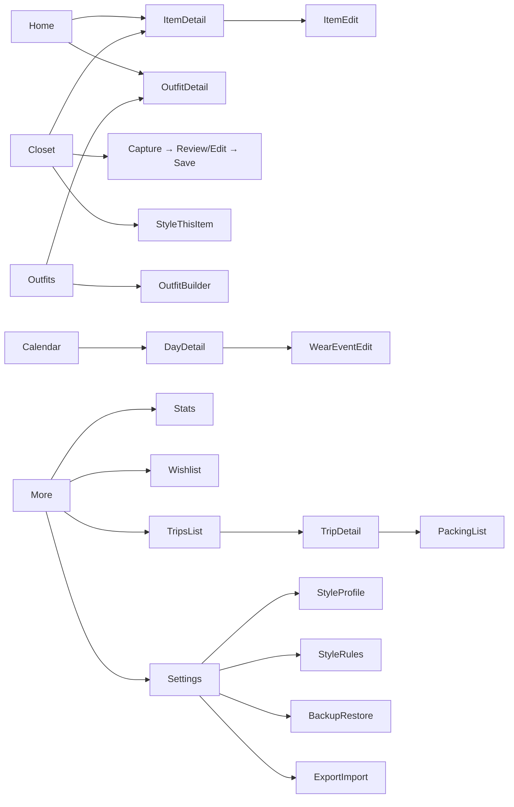
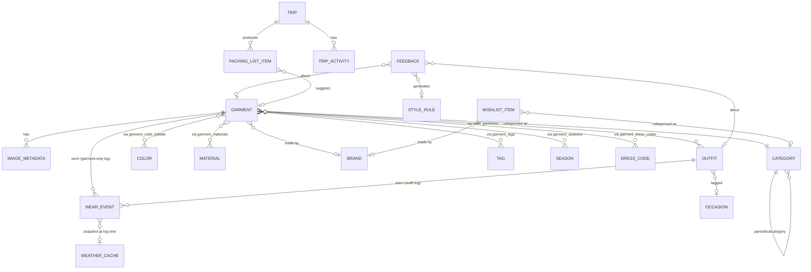
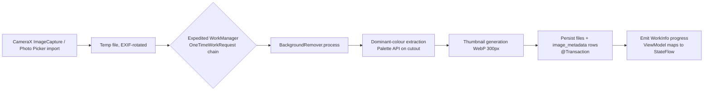

# Phase 1 — Architecture
## AI Digital Closet & Stylist App (offline-only, Android native)

Configuration in force: Android native (Kotlin/Compose), no backend, no auth, no Firebase,
no cloud, zero-cost. Feature tiers as locked in `alta-class-closet-app-master-prompt.md`
Section 0. Base package: `com.wardrobe.app`.

**Product identity, made permanent 2026-08-03 (Constitution rule 13,
[ADR-011](docs/adr/ADR-011-permanent-privacy-first-principles.md))**: this
is a **privacy-first, offline-first personal wardrobe operating system**,
not merely "an AI wardrobe app." Every principle below was already true in
practice by Phase 9; rule 13 makes it a binding, permanent constraint
rather than a Phase-1-era default — see ADR-011 for the full reasoning.

No code in this document, per the constitution and your explicit instruction.

---

## 0. Two pushbacks before the architecture, per Constitution rule 5

**1. "Statistics" as a literal Room entity is the wrong shape.** A table that stores
precomputed numbers (usage %, favourite colour, etc.) as rows will drift from the
underlying `WearEvent`/`Garment` data the moment either changes, and you'd need to
remember to update it everywhere. Instead: every stat is a **derived query** over
`WearEvent`/`Garment`/`Outfit` (single source of truth), with a thin `StatsCacheEntity`
used *only* as a performance cache for the handful of expensive multi-join aggregates
(weekday-vs-weekend, favourite fabric by month), invalidated on write. Section 9 and
Section 12 detail this.

**2. `android:allowBackup` will silently violate "no cloud" if left at its default.**
Android's Auto Backup uploads app data (including Room DB and files dir, i.e. every
garment photo) to the user's Google Drive account by default on API 23+, with no
in-app UI and no relation to the app's own Backup/Restore feature. That is a second,
invisible cloud copy of exactly the data this app promises stays local. Section 24
(Security) specifies the required `backup_rules.xml` exclusions. This is not optional —
flag it now because it's the kind of thing that's invisible until a user notices their
photos synced somewhere they didn't expect.

Everything else in your list is buildable as specified within the offline/zero-cost
posture. One capability needs verification, not rejection: see Section 16 (Background
removal).

---

## 1. Overall architecture diagram



**Dependency rule**: arrows point inward only. `core:model` and `core:domain` depend on
nothing Android-specific — this is what makes a future Kotlin Multiplatform move
(Section 30) additive rather than a rewrite. `feature:*` modules never import
`core:database`, `core:network`, or `core:datastore` directly — only `core:domain`
interfaces and `core:model`. Hilt (`app` module + `core:data`'s `@Module`s) wires
implementations to interfaces so this is invisible to features.

---

## 2 & 3. Package/folder structure and module breakdown

```
wardrobe/
├── app/                          # Application class, MainActivity, NavHost, Hilt @HiltAndroidApp, DI wiring
├── core/
│   ├── model/                    # Pure Kotlin domain models (Garment, Outfit, WearEvent, StyleRule, ...)
│   ├── domain/                   # Use cases + repository interfaces. Depends only on :core:model
│   ├── common/                   # Dispatchers, Result/AppError types, date/unit utils, coroutine scopes
│   ├── database/                 # Room: entities, DAOs, migrations, TypeConverters
│   ├── datastore/                # Preferences DataStore: UserPreferences, StyleProfile scalars
│   ├── network/                  # Weather API client only (Retrofit/Ktor + Moshi/kotlinx.serialization)
│   ├── image/                    # File storage, compression, thumbnailing, BackgroundRemover interface + impls
│   ├── data/                     # Repository implementations binding domain interfaces to the above
│   ├── designsystem/             # Material3 theme, color/type/spacing tokens, base components
│   ├── ui/                       # Shared composables (EmptyState, ConfidenceBadge, ErrorBanner, UiState<T>)
│   └── testing/                  # Fakes, test fixtures, Room in-memory test DB helper
├── feature/
│   ├── closet/                   # Capture, browse, item detail/edit, "Style this item"
│   ├── outfits/                  # Manual builder, saved looks, outfit detail
│   ├── calendar/                 # Wear logging, month/week/day views
│   ├── stats/                    # Closet stats, cost-per-wear, gap analysis
│   ├── wishlist/
│   ├── trips/                    # Packing list, travel lookbook
│   ├── settings/                 # Style profile, style rules, backup/restore, export/import, about
│   └── widget/                   # Glance home-screen widget
└── build-logic/                  # Gradle convention plugins (shared Kotlin/Compose/lint config)
```

18 modules. **Rejected alternative**: one module per screen (~35 modules). For a
solo-maintained app that buys negligible incremental build-parallelism at real cost —
every screen-level module needs its own `build.gradle.kts`, Hilt module wiring, and
version catalog upkeep. Feature-level granularity (one module per bottom-nav
destination's feature area) is the point where modularity's benefits (enforced
boundaries, independent iteration, faster incremental builds on the module you're
touching) start paying for their overhead.

---

## 4. Feature list (KEEP scope only — restated from Section 0 tier table)

| Feature | Module |
|---|---|
| Capture / gallery import | feature:closet |
| On-device background removal | core:image, feature:closet |
| Manual attribute tagging & edit | feature:closet |
| Closet browse (sort/filter/search/density) | feature:closet |
| Manual outfit builder | feature:outfits |
| Rule-based occasion/weather outfit suggestions | feature:outfits (engine in core:domain) |
| "Style this item" | feature:closet, feature:outfits |
| Wear logging + calendar | feature:calendar |
| Closet stats, cost-per-wear, dormant items | feature:stats |
| Feedback loop → style rules | feature:outfits, feature:settings |
| Wishlist + gap analysis | feature:wishlist, feature:stats |
| Trips / packing list | feature:trips |
| Backup / restore / export / import | feature:settings |
| Home-screen widget | feature:widget |
| Weather-aware suggestions (Open-Meteo, cached, offline-fallback) | core:network, core:data |

DEFERRED (designed for, not built): coarse on-device attribute suggestion, rule-based
Style Horoscope, file-export sharing. CUT (no module, no interface stub): AI chat,
avatar/try-on, shopping feed, receipt import, community.

---

## 5. Data flow (example: adding a garment)



Reads follow the same shape in reverse: DAO returns `Flow<List<Entity>>` → Repository
maps to `Flow<List<DomainModel>>` → Use case (if any transform needed) → ViewModel
`stateIn(viewModelScope, SharingStarted.WhileSubscribed(5_000), initial)` → Compose
collects via `collectAsStateWithLifecycle()`.

---

## 6 & 7. UI flow and navigation graph

Five bottom-nav destinations (no "Ask"/chat tab, no Community tab — both CUT):



Navigation-Compose with **type-safe routes** (`@Serializable` route classes, Nav
2.8+), one `NavHost` in `app`, each feature module exposes a
`NavGraphBuilder.xGraph(navController)` extension registered into the host — features
never reference each other's routes directly; cross-feature navigation goes through a
route class in `core:model` (e.g. `ItemDetailRoute(garmentId)`) that any module can
construct without depending on the module that owns the screen.

---

## 8. State management

- ViewModels expose `StateFlow<ScreenState>` for UI state and `SharedFlow<ScreenEvent>`
  for one-off effects (navigation, snackbar, haptic).
- Every screen's state is its own sealed class (`ClosetListState`, `ItemDetailState`,
  …) rather than one generic `UiState<T>` reused everywhere — a shared generic looks
  DRY but hides per-screen nuance (e.g. Closet needs `Empty` vs `NoResultsForFilter`
  vs `Offline(stale: Boolean)` as genuinely distinct states, not one flag).
- `core:ui` provides a **marker interface** (`ScreenState.Loading`,
  `ScreenState.Error`) so shared composables (`ErrorBanner`, loading shimmer) can be
  written once against the marker, without forcing every screen into one class shape.
- Weather/network-backed states always carry a `isStale: Boolean` + `lastUpdated:
  Instant` rather than collapsing to a binary online/offline, per Constitution rule 8.

---

## 9. Database schema (see Section 12 for the full ERD)

Room, single database (`WardrobeDatabase`), version 1, `fallbackToDestructiveMigration`
**disabled** — real migrations from day one since this is a personal data store users
will accumulate for years.

| Table | Purpose |
|---|---|
| `garments` | Core item record |
| `categories` | Self-referencing (top-level + subcategory via `parentId`) |
| `colors` | Palette reference (name + hex) |
| `garment_color_palette` | Garment↔Color, junction, `weightPercent` |
| `materials` | Fabric reference |
| `garment_materials` | Garment↔Material, junction, `percentage` (blends) |
| `brands` | |
| `garment_tags` / `tags` | Free-form user tags, junction |
| `seasons` (fixed 4 rows, seeded) | |
| `garment_seasons` | Junction — see indexing rationale below |
| `dress_codes` (fixed rows, seeded) | |
| `garment_dress_codes` | Junction |
| `outfits` | |
| `outfit_garments` | Junction, `layerSlot: Int` (ordering/layering) |
| `occasions` | User-extensible |
| `wear_events` | Garment OR outfit worn on a date |
| `style_rules` | Persistent scoring constraints |
| `feedback` | Thumbs up/down + reason, links to generated `style_rules` row |
| `style_profile_preferred_brands` / `style_profile_avoided_categories` | Junctions against a single-row scalar profile (rest of profile lives in DataStore — see below) |
| `trips` | |
| `trip_activities` | |
| `packing_list_items` | |
| `wishlist_items` | |
| `weather_cache` | |
| `image_metadata` | One row per stored image (original/cutout/thumbnail) |
| `stats_cache` | Performance cache only, not source of truth (Section 0 pushback #1) |

**Why junction tables for `seasons` and `dress_codes` instead of a bitmask column**:
Closet Browse must filter by season/dress-code (Section 4). SQLite can put a real
index on a junction table's foreign key and satisfy `WHERE season_id = ?` efficiently;
a bitmask column can't be indexed for arbitrary flag queries without an expression
index workaround. Fixed small vocabularies still get a real table (seeded once, not
user-editable) because it's the cheaper trade against "future-you needs to add a
fifth season-like value" — small variable-count reference tables never hurt filtering
performance at this scale (a few hundred to low thousands of garments).

**`wear_events` XOR constraint**: exactly one of `garmentId` / `outfitId` must be
non-null. Room/SQLite cannot express a `CHECK (garmentId IS NOT NULL) != (outfitId IS
NOT NULL)`-style XOR through Room annotations — this is enforced at the repository
layer (validated before insert, unit-tested in Phase 8), not the schema layer. Calling
this out explicitly per Constitution rule 4: don't imply the DB guarantees something it
doesn't.

**Scalar `StyleProfile` fields (occupation, gender preference, free-text blurb, budget
band) live in DataStore Preferences, not Room** — they're single-user, single-row,
non-relational scalars with no query/filter/join requirement, so a preferences store is
the honest fit; only the *relational* parts of the profile (preferred brands, avoided
categories — both reference other tables) get Room junction tables.

### Indexing

| Table.Column | Index type | Reason |
|---|---|---|
| `garments.categoryId` | non-unique | Category filter, very common |
| `garments.status` | non-unique | "active" filter on every Closet Browse query |
| `garments.brandId` | non-unique | Stats: favourite brands |
| `wear_events.date` | non-unique | Calendar range queries, stats trend graphs |
| `wear_events.garmentId`, `wear_events.outfitId` | non-unique, both nullable-safe | Cost-per-wear, dormant-item queries |
| `garment_color_palette.garmentId`, `.colorId` | composite unique | Signature-colour stats, prevents dup rows |
| `garment_materials.garmentId`, `.materialId` | composite unique | Same reason |
| `garment_seasons` / `garment_dress_codes` | composite unique on (garmentId, refId) | Filter + prevents dup |
| `image_metadata.garmentId` | non-unique | 1 garment → up to 3 images lookup |
| `weather_cache.(lat, lon, fetchedAt)` | composite | Cache-key lookup + staleness eviction |
| `feedback.generatedStyleRuleId` | non-unique, nullable | Traceability lookups (rule → originating feedback) |

---

## 10. Entity Relationship Diagram



---

## 11. Repository interfaces (core:domain — signatures, no implementation)

```
GarmentRepository:
    fun observeGarments(filter: GarmentFilter): Flow<List<Garment>>
    suspend fun getGarment(id: GarmentId): Garment?
    suspend fun saveGarment(garment: Garment, images: ProcessedImageResult): GarmentId
    suspend fun updateGarment(garment: Garment)
    suspend fun setStatus(id: GarmentId, status: GarmentStatus)
    suspend fun deleteGarment(id: GarmentId)   // cascades image files, not just rows

OutfitRepository:
    fun observeOutfits(filter: OutfitFilter): Flow<List<Outfit>>
    suspend fun saveOutfit(outfit: Outfit): OutfitId
    suspend fun deleteOutfit(id: OutfitId)

WearEventRepository:
    fun observeEvents(range: DateRange): Flow<List<WearEvent>>
    suspend fun logWear(event: WearEvent)   // enforces garmentId XOR outfitId
    suspend fun deleteEvent(id: WearEventId)

StyleRuleRepository:
    fun observeActiveRules(): Flow<List<StyleRule>>
    suspend fun recordFeedback(feedback: Feedback): StyleRule?   // may derive a rule
    suspend fun addUserRule(rule: StyleRule)
    suspend fun deleteRule(id: StyleRuleId)

StylingEngineRepository:   // Phase 6 detail; interface only, no LLM
    suspend fun suggestOutfits(context: SuggestionContext): List<ScoredOutfit>
    suspend fun suggestForItem(garmentId: GarmentId, context: SuggestionContext): List<ScoredOutfit>

StatsRepository:
    fun observeUsageStats(window: StatsWindow): Flow<UsageStats>
    fun observeCostPerWear(): Flow<List<CostPerWearEntry>>
    fun observeClosetGaps(): Flow<List<ClosetGap>>

WishlistRepository / TripRepository / WeatherRepository / BackupRepository:
    (same Flow-for-read / suspend-for-write shape, omitted for brevity)

WeatherRepository:
    suspend fun getCurrentAndForecast(loc: Location): Result<WeatherSnapshot, WeatherError>
    // always returns cached snapshot on network failure, with isStale flag — never a bare error
```

Every repository interface lives in `core:domain`; implementations in `core:data`
depend on `core:database`/`core:network`/`core:image`/`core:datastore` and are bound
via `@Binds` in a Hilt `@Module` — features only ever see the interface.

---

## 12. Use cases (core:domain — one class, one responsibility)

`AddGarmentUseCase`, `UpdateGarmentUseCase`, `DeleteGarmentUseCase`,
`FilterGarmentsUseCase`, `BuildOutfitUseCase`, `SuggestDailyOutfitsUseCase`,
`SuggestOutfitsForItemUseCase` (wraps `StylingEngineRepository`, injects current
weather via `WeatherRepository` and active `StyleRule`s), `LogWearUseCase`,
`RecordFeedbackUseCase` (calls `StyleRuleRepository.recordFeedback`, then re-triggers
suggestion invalidation), `ComputeUsageStatsUseCase`, `ComputeCostPerWearUseCase`,
`ComputeClosetGapsUseCase`, `PlanTripPackingListUseCase`, `AddWishlistItemUseCase`,
`ExportBackupUseCase`, `RestoreBackupUseCase`, `ExportLookAsImageUseCase` (the
file-share replacement for social sharing).

Each is a single `operator fun invoke(...)`, testable without Android, no shared base
class — a `UseCase<In, Out>` interface was considered and rejected: the inputs/outputs
here are heterogeneous enough (some Flow-returning, some suspend, some no-arg) that
forcing one shape adds an abstraction with no real code reuse behind it.

---

## 13. ViewModels (one per screen, `@HiltViewModel`, feature modules)

`ClosetListViewModel`, `ItemCaptureViewModel` (owns the CameraX + processing pipeline
state machine), `ItemDetailViewModel`, `ItemEditViewModel`, `OutfitBuilderViewModel`,
`OutfitDetailViewModel`, `CalendarViewModel`, `DayDetailViewModel`, `StatsViewModel`,
`WishlistViewModel`, `TripListViewModel`, `TripDetailViewModel`,
`PackingListViewModel`, `StyleProfileViewModel`, `StyleRulesViewModel`,
`BackupRestoreViewModel`, `ExportImportViewModel`.

Pattern: constructor-inject use cases (never repositories directly — keeps ViewModels
from re-implementing orchestration logic that belongs in a use case),
`SavedStateHandle` for nav-arg-derived IDs, `stateIn` for cold→hot Flow conversion at
the ViewModel boundary only.

---

## 14. Dependency injection graph (Hilt)

```mermaid
graph TB
    App[WardrobeApplication @HiltAndroidApp] --> DBModule[DatabaseModule\n@Provides WardrobeDatabase, DAOs]
    App --> DSModule[DataStoreModule]
    App --> NetModule[NetworkModule\nRetrofit + Open-Meteo service]
    App --> ImgModule[ImageModule\n@Binds BackgroundRemover impl]
    App --> RepoModule[RepositoryModule\n@Binds all core:domain interfaces → core:data impls]
    RepoModule --> DBModule
    RepoModule --> DSModule
    RepoModule --> NetModule
    RepoModule --> ImgModule
    VM["@HiltViewModel classes\n(feature modules)"] -->|constructor injection| UseCases[Use cases]
    UseCases -->|constructor injection| RepoModule
    Widget[Glance Widget receiver] -->|EntryPoint, not ViewModel| RepoModule
```

`@Singleton` scope: `WardrobeDatabase`, DataStore instance, Retrofit/OkHttp client,
`BackgroundRemover` (model load is expensive — load once). Repositories are
`@Singleton` (stateless wrappers over singleton data sources). ViewModels are
Hilt/Nav-Compose scoped per back-stack entry, as normal.

---

## 15 & 16. Camera pipeline and background-removal pipeline



- Capture via CameraX (`Preview` + `ImageCapture` use cases); gallery import via the
  Android **Photo Picker** (`ActivityResultContracts.PickVisualMedia`) — no broad
  storage permission needed on API 33+; falls back to `READ_MEDIA_IMAGES` runtime
  permission below API 33.
- Processing runs as an **expedited** `OneTimeWorkRequest` chain (not a blocking
  suspend call in the ViewModel) so the app stays responsive and the OS can prioritize
  it while the app is foregrounded; `WorkInfo` is observed as a `Flow` and mapped to
  ViewModel state so the Review/Edit screen shows a live progress state
  (`Processing → Ready(confidence) → Failed(retry)`).
- Constitution rule 7 in practice: every attribute the pipeline fills in
  (category guess, dominant colour, season/dress-code suggestion — see next bullet)
  is written to the DB with an `isReviewed = false` flag and rendered as an editable
  chip with a confidence dot, never as plain text presented as fact.

**Background removal — verification required before committing (Constitution rule
4):** two candidate approaches, both fully on-device:

| Option | What it actually is | Known-good for | Unverified for this app |
|---|---|---|---|
| ML Kit **Subject Segmentation** (`com.google.mlkit:subject-segmentation`) | On-device general foreground/background separation (not the older *Selfie* Segmentation, which is people-only) | General photo subjects, small APK footprint, no model bundling | Its published examples target photos of one clearly separated subject on a busy background; garment photos on a hanger/flat-lay with thin straps, cutout necklines, or two overlapping items are a different distribution than what it's demonstrated on |
| Bundled TFLite salient-object model (e.g. a U2Net/MODNet export) | A specific model file you own and can benchmark | Product-photography-style cutouts, proven in e-commerce cutout tools | Larger APK (roughly 5–25MB depending on the export), you own the licensing (check the specific pretrained weights' license before bundling), you own inference-speed tuning on low-end devices |

**Decision**: build `BackgroundRemover` as an interface with a single method
(`suspend fun removeBackground(bitmap: Bitmap): CutoutResult`) from day one, so this is
a swappable implementation, not an architecture decision. Before Phase 5b locks in an
implementation, spend a short spike: run ML Kit Subject Segmentation against ~20 real
garment photos (flat-lay, on-hanger, worn) and check edge quality. If it's not good
enough, fall back to a bundled TFLite model. Either way the rest of the app is
unaffected because nothing outside `core:image` knows which one is running.

---

## 17. Image system

| Concern | Design |
|---|---|
| Storage location | App-specific internal storage (`context.filesDir/images/{garmentId}/`) — not `MediaStore`, since these aren't user-facing gallery media until explicitly exported |
| Files per garment | `original.jpg` (long edge capped 2048px, quality 85), `cutout.webp` (lossless, alpha channel, same cap), `thumb.webp` (300px, quality 80) |
| Compression | JPEG for photographic original (no alpha needed); lossless WebP for cutout (alpha + smaller than PNG); lossy WebP for thumbnail |
| Thumbnailing | Generated once during the capture pipeline (Section 16), never on-demand at scroll time |
| Caching (in-memory/disk for display) | **Coil**, standard `AsyncImage` in Compose — has its own memory + disk LRU cache; no custom cache layer invented on top |
| Cropping | User-adjustable crop before the background-removal step, standard Compose gesture-driven crop overlay |
| Metadata | `image_metadata` table (Section 9): dimensions, byte size, format, checksum (used by Backup/Restore integrity check, Section 18) |
| Storage cleanup | `OrphanedImageCleanupWorker` (periodic, `WorkManager`, `NetworkType.NOT_REQUIRED`): deletes files with no matching `image_metadata` row (crash/interruption during the capture pipeline is the only way this happens) |
| Footprint estimate | 500 garments × (≈250KB original + ≈150KB cutout + ≈15KB thumb) ≈ **207MB**. Worth surfacing in Settings as a storage figure since there's no cloud copy to fall back on |

---

## 18. Weather integration

- **Open-Meteo** (`api.open-meteo.com`) — free, no API key, no rate-limit auth needed
  for personal-scale use. This is the only outbound network call the whole app makes.
- Fetched via `WeatherRefreshWorker`: periodic (~every 3h), constrained to
  `NetworkType.CONNECTED`, not expedited (never worth waking radio/battery for).
- Every read goes through `WeatherRepository`, which **always** returns a value: fresh
  if `weather_cache` is recent, otherwise the last cached row with `isStale = true` and
  `lastUpdated`. A suggestion screen with no network ever shows a "can't get outfit
  suggestions" dead-end — it shows a "using yesterday's forecast" banner instead
  (Constitution rule 8).
- Location: device's last-known location (coarse), or a manually-set city in Settings
  for users who don't want to grant location permission — this is a deliberate
  offline-friendly fallback the source app doesn't need to worry about since it's
  server-backed.

---

## 19 & 20. Backup/Restore and Import/Export architecture

- **Backup** = a single `.wardrobebackup` file: a zip containing the Room DB (via
  Room's `Checkpoint` + file copy, not a live-handle copy), the DataStore preferences
  file, and the full `images/` directory, plus a manifest (`schemaVersion`,
  `createdAt`, per-file checksum from `image_metadata`).
- **Restore**: validates manifest schema version against current `AppDatabase`
  version; if older, runs the same Room migrations restore would trigger on open, not
  a special-cased path — restore is "put the files back, then open the DB normally."
- **Export** (single item/look, not full backup): renders a look or item card to a
  shareable image/PDF via `ExportLookAsImageUseCase`, using the Android share sheet —
  this is also the mechanism replacing "friends/private sharing" (Section 0 DEFER).
- **Import** here means *backup* import, not the CUT product-database/receipt import
  features — no confusion with those.
- Both flows run as foreground-service-backed `WorkManager` jobs (large file I/O,
  should survive the user backgrounding the app) with a visible progress
  notification, never silently in the background.
- User-triggered only in v1 (a button in Settings) — no scheduled auto-backup to
  avoid surprising battery/storage usage; scheduled backup is a reasonable
  Phase 9+ addition, noted in Section 30, not built now.

---

## 21–23. Performance, memory, battery

| Area | Strategy |
|---|---|
| Cold start | Baseline Profile generation (Macrobenchmark), lazy Hilt component init, no eager DB warm-query on launch |
| Closet scroll at 1000+ items | `LazyVerticalGrid` with stable keys (`garmentId`), Room `PagingSource` (Paging 3) rather than loading the full list into memory, thumbnails only (never full-res in a list) |
| Image memory | Coil's `ImageLoader` sized per-device (`maxSizePercent`), thumbnails capped 300px so grid scroll never decodes full-res bitmaps |
| DB query plans | All list/filter queries backed by the indices in Section 9; `EXPLAIN QUERY PLAN` checked in a Phase 8 test for the three heaviest stats queries |
| Background work batching | Image processing, weather refresh, and cleanup are three separate `WorkManager` workers with distinct constraints — never one monolithic "sync" job |
| Battery | No polling loops; weather refresh capped at ~3h and network-gated; ML inference only runs synchronously with an explicit user action (capture), never speculatively |
| Measurement | Macrobenchmark (startup, scroll jank) + `WorkManager`'s own diagnostics — "measure, don't assume" is executed in Phase 9, not asserted here |

---

## 24. Security strategy

- **`backup_rules.xml` / `data_extraction_rules.xml` must explicitly exclude the
  Room DB file and `images/` directory from Android Auto Backup** (Section 0 pushback
  #2) — otherwise Google's device-to-device/cloud backup silently copies exactly the
  data this app promises stays local. The app's own Backup/Restore feature is the only
  intended copy mechanism, and it's user-initiated and user-held.
- Standard app sandbox (scoped storage, no root assumptions) is sufficient for v1 —
  no on-disk DB encryption (SQLCipher) by default, since there's no server-side threat
  model and no shared-device requirement stated. Documented as a DEFER: if this
  becomes multi-user-on-shared-device relevant, SQLCipher-backed Room is a contained
  swap (it implements the same `SupportSQLiteOpenHelper` interface Room already uses).
- Permissions requested: `CAMERA`, `READ_MEDIA_IMAGES` (API <33 fallback only),
  coarse `ACCESS_COARSE_LOCATION` (optional, for weather) — nothing else. No
  `INTERNET`-adjacent broad permission beyond what Open-Meteo needs.
- No analytics SDK, no crash-reporting SDK (Crashlytics would itself be a Firebase
  dependency, explicitly ruled out) — Play Console's built-in ANR/crash reporting
  (automatic for apps distributed via Play, no SDK integration required) is the only
  crash visibility in v1.

---

## 25. Error handling strategy

- `sealed interface AppError` hierarchy in `core:common`: `Recoverable` (retry-able —
  network, transient IO) vs `NonRecoverable` (corrupt file, migration failure).
- Repository methods return `Result<T, AppError>` (custom, not exceptions, at the
  domain boundary) so ViewModels pattern-match rather than try/catch across coroutine
  boundaries.
- Every screen state (Section 8) can represent its own error inline — no app-wide
  crash-to-white-screen for a recoverable error (e.g. weather fetch failing does not
  take down the outfit-suggestion screen, per Section 18).

---

## 26. Logging strategy

- Timber, wrapped behind a thin `core:common` logger interface (so the underlying
  library is swappable without touching call sites).
- No PII (no file paths with user-identifying info, no raw photo bytes) in log lines.
- Release builds strip debug-level logs via R8/ProGuard rule, keep warn/error only.
- A local-only "export diagnostic log" option in Settings (writes to a text file,
  shareable via the share sheet) — since there's no remote log aggregation, this is
  the only way to get logs off-device for support, and it's explicit/user-triggered.

---

## 27. Testing strategy (detail deferred to Phase 8, scope stated now)

Unit tests: use cases (pure Kotlin, no Android), the styling engine's scoring/weather
filter with adversarial cases (heatwave, monsoon, formal-only-closet, empty closet).
Room: in-memory DB + migration tests. Hilt: `@HiltAndroidTest` graph validation.
Compose: semantics-based UI tests for the critical flows (capture→save,
build-outfit, log-wear). CameraX/ML Kit: instrumented, device-dependent, acknowledged
as the hardest tier to automate — Phase 8 will state coverage honestly rather than
claim full automation here.

---

## 28. Accessibility

TalkBack content descriptions on every image/icon-only control (especially the
attribute confidence chips — icon *and* text, never colour-only, which also satisfies
Constitution rule 7's "never present a guess as fact" from an accessibility angle).
Minimum 48dp touch targets. Full dynamic text scaling support (no fixed-height text
containers). Material3 color tokens checked for WCAG AA contrast in both themes.

---

## 29. Internationalization

All strings externalized (`strings.xml`, no hardcoded UI text). RTL via Compose's
built-in layout-direction mirroring (no manual mirroring logic). Units
(metric/imperial, °C/°F) are a Settings preference, not locale-inferred, since a
weather-driven wardrobe app is exactly the case where getting this wrong is visible
daily. Currency: stored as `{amount, ISO currency code}` per garment, displayed with
locale-aware formatting — no FX conversion (would require a network dependency this
app doesn't have and shouldn't add for a personal cost-per-wear number).

---

## 30. Future extensibility (planned, not implemented)

**Updated 2026-08-03 per Constitution rule 13 / ADR-011**: every row below
is now read subject to the permanent no-cloud/local-only-ML principles —
several rows that originally described a cloud-backed path have been
corrected to their now-permanent local-only shape, and two rows
(Virtual try-on, Cloud sync) have already moved from "future" to
"implemented, locally" as of Phase 10 and Phase 8 respectively.

| Future feature | Why today's architecture doesn't block it |
|---|---|
| AI Stylist chat | `StylingEngineRepository` is already an interface (Section 11); **per Constitution rule 13/ADR-011, any future conversational implementation must run fully on-device (e.g. a bundled small local model) — a cloud-LLM-backed `@Binds` target is permanently excluded, not merely gated by a cost-disclosure toggle.** The rule-based implementation doesn't need to change either way. |
| Virtual try-on / avatar | **Implemented in Phase 10** as a fully local 2D compositing system (no 3D avatar, no cloud rendering, no uploaded photos) — see `phase-10-personal-virtual-tryon.md`. Consumes existing `Garment`/`Outfit` models and Phase 5b's background-removed image assets unchanged. The commerce/community feature set the teardown bundled alongside avatar/try-on remains cut. |
| Shopping integration | New `ShoppingRepository` interface + `feature:shop`; `ClosetGap` (Section 11) already produces the "what's missing" signal a shopping feed would consume. Any such feature must still satisfy rule 13 (no account required, no cloud storage of wardrobe data) even if it links out to a retailer. |
| Cloud sync | **Superseded by Phase 8's local-network encrypted sync** (QR pairing, incremental outbox, `syncId`-keyed conflict resolution) — per Constitution rule 13/ADR-011, sync is permanently local-network-only; a server-mediated relay is not a future option, regardless of convenience for devices that are never on the same network. |
| Desktop / iOS | Because `core:model` + `core:domain` are pure Kotlin with no Android imports, a Kotlin Multiplatform split of exactly those two modules is the migration path — not a rewrite. Any such build must keep the same local-only data model; it is not an opportunity to introduce a backend. |
| WearOS | A companion module reading a subset of `core:model` (today's suggested outfit, wear-logging shortcut) over a local Bluetooth/Wear Data Layer bridge — no cloud needed even here, consistent with rule 13. |
| Tablet layout | `WindowSizeClass`-adaptive scaffolding is worth adopting now (light touch — it's a parameter, not a rewrite) even though tablet-specific layouts aren't built in v1 |

---

## Decision table — architectural choices vs rejected alternatives

| Decision | Rejected alternative | Why |
|---|---|---|
| 18 feature/core modules | One module per screen (~35) | Solo-maintained app; per-module Gradle overhead outweighs parallel-build benefit at that granularity |
| Repository interfaces in `core:domain`, impls in `core:data` | Repositories directly in feature modules | Keeps features from depending on Room/network/DataStore at all — required for the KMP/future-extensibility story in Section 30 |
| Per-screen sealed state classes | One generic `UiState<T>` | Generic reuse looked appealing but collapses genuinely different states (stale-offline vs empty vs no-filter-results) into booleans |
| Junction tables for season/dress-code | Bitmask column | Filtering by season/dress-code is a first-class Closet Browse requirement; bitmasks aren't cleanly indexable in SQLite |
| Derived stats + thin cache table | Persisted `Statistics` entity as source of truth | Avoids a second copy of truth that can silently drift from `WearEvent`/`Garment` |
| `BackgroundRemover` as swappable interface, decision deferred to a Phase 5b spike | Committing to ML Kit Subject Segmentation now | Its demonstrated use cases don't clearly cover garment-on-hanger/flat-lay edge cases; costs nothing to gate behind an interface |
| Coil for image caching | Custom LRU cache | Reinventing a well-tested wheel for no documented app-specific need |
| WorkManager (expedited) for image pipeline | Direct suspend call from ViewModel | Keeps processing alive across process death/backgrounding without extra plumbing |
| No crash-reporting SDK | Firebase Crashlytics | Explicitly ruled out by "No Firebase"; Play Console's native crash reporting is free and already present |

---

## Top five risks and mitigations

| # | Risk | Mitigation |
|---|---|---|
| 1 | On-device background removal quality is worse than Alta's server-side model, undermining the core capture experience | Spike-test before committing (Section 16); design the confidence-signalled editable-attribute UI (rule 7) so a bad cutout is fixable, not a dead end |
| 2 | Android Auto Backup silently uploads photos/DB to Google Drive, breaking the "no cloud" promise without the user noticing | `backup_rules.xml` exclusions specified now, verified in Phase 8 with an actual backup-trigger test |
| 3 | Closet scroll/stats performance degrades past ~1000 garments on low-end devices | Paging 3 + indexed queries designed in from Phase 3, Macrobenchmark gating in Phase 9 rather than discovered late |
| 4 | Rule-based styling engine (no LLM) produces suggestions that feel mechanical compared to the source app's LLM-backed one | Section 30 leaves an explicit, low-friction seam (`StylingEngineRepository`) to add an LLM-backed implementation later without touching the rest of the app, if budget posture ever changes |
| 5 | 18-module structure is over-engineering for what may stay a single-user app | Module boundaries cost Gradle config, not runtime behavior; if this proves to be too much ceremony in practice, collapsing `feature:*` modules back into fewer packages inside `app` is a mechanical un-modularization, not an architecture change |

---

**End of Phase 1. No code was written, per instruction.** Waiting for your review/
approval before Phase 2 (project & folder structure with actual build files).
